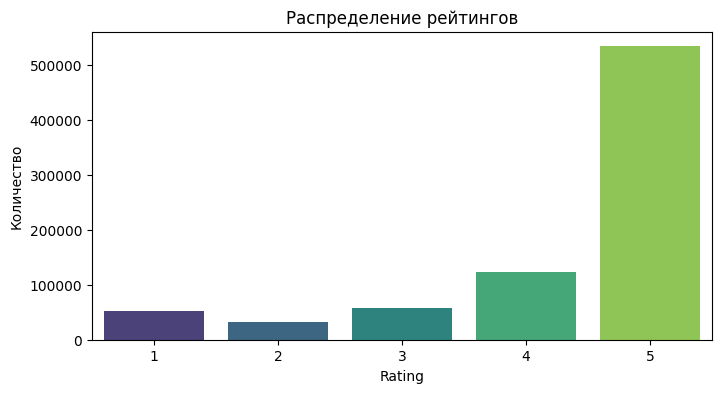
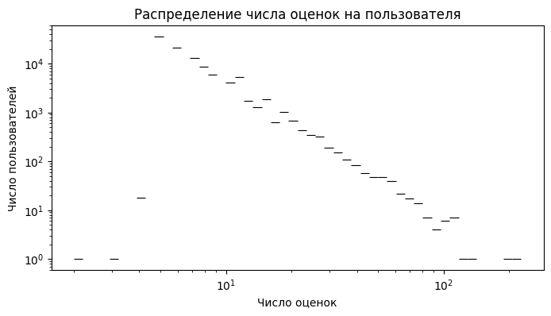
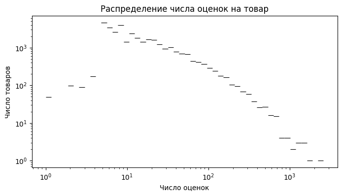
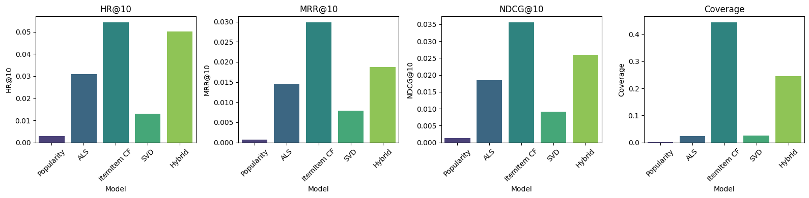
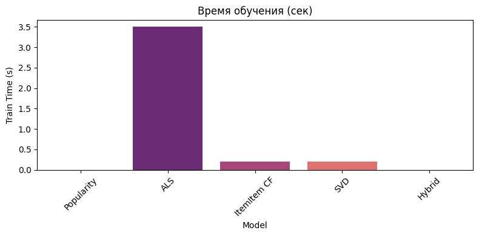

# 🛍️ RecSys — Система рекомендаций на отзывах Amazon


**Рекомендательная система** на основе отзывов пользователей Amazon (категория **Patio, Lawn and Garden**).  
Проект содержит полный пайплайн: **EDA → предобработка → несколько моделей → оценка → визуализация**.

## ✨ Основные возможности

- **Полный EDA** с анализом разреженности, распределения рейтингов и активности пользователей
- **Leave-One-Out** сплит по времени (последний отзыв пользователя — в тест)
- **5 моделей**:
  - Popularity (бейзлайн)
  - ALS (implicit library)
  - Item-Item Collaborative Filtering
  - SVD (матричная факторизация)
  - Hybrid (взвешенная комбинация)
- **Метрики**: HR@10, MRR@10, NDCG@10, Coverage
- Красивые визуализации с `matplotlib` + `seaborn`
- Подробные комментарии и таблицы сравнения

## 📊 Ключевые характеристики датасета

**Источник**: [Amazon Reviews 2018 — Patio_Lawn_and_Garden_5.json.gz](https://jmcauley.ucsd.edu/data/amazon/) (798 415 отзывов)

| Параметр                  | Значение      | Комментарий                     |
|---------------------------|---------------|---------------------------------|
| Кол-во отзывов            | 798 415       | —                               |
| Уникальных пользователей  | 103 431       | —                               |
| Уникальных товаров (ASIN) | 32 918        | —                               |
| Разреженность матрицы     | ~99.98%       | Очень сложная задача            |
| Средний рейтинг           | 4.32          | Сильный bias к 5 звёздам       |
| Период данных             | 2000–2018     | —                               |

**Графики EDA** (см. папку `images/` после запуска ноутбука):

1. **Распределение рейтингов** (`sns.barplot`) — преобладают оценки `5.0` (~533k).
2. 
3. **Активность пользователей** (`sns.histplot`, log-scale) — большинство оставляет 1–10 отзывов (правый скос).
4. 
5. **Активность товаров** — аналогично, несколько хитов с тысячами отзывов.

## 🏗️ Структура проекта

```bash
recv_sys/
├── rec_sys.ipynb              # Основной ноутбук (исходник)
├── requirements.txt           # Зависимости (см. выше)
├── README.md                  # Этот файл
├── data/                      # ← скачайте сюда Patio_Lawn_and_Garden_5.json.gz
├── images/                    # Графики (создайте папку и сохраните из ноутбука)
├── src/                       # (рекомендуется) — модули моделей, utils, evaluation
│   ├── models.py
│   ├── evaluation.py
│   └── data_utils.py
└── .gitignore
```
# 🚀 Установка и запуск
## 1. Клонировать репозиторий
git clone https://github.com/AlexKretov/recv_sys.git
cd recv_sys

## 2. Установить зависимости
pip install -r requirements.txt

## 3. Скачать датасет (5-core версия)
## Скачайте https://jmcauley.ucsd.edu/data/amazon_v2/categoryFilesSmall/Patio_Lawn_and_Garden_5.json.gz
## и разархивируйте в папку data/

## 4. Запустить
jupyter notebook rec_sys.ipynb

# 📈 Результаты моделей (k=10)
Сводная таблица (значения взяты из выполнения ноутбука):  
|Model|	HR@10|	MRR@10|	NDCG@10	|Coverage|	Train Time (s)|	Комментарий|
|-----|------|--------|---------|--------|----------------|-------------|
|Popularity|	0.0030|	0.0007|	0.0012|	0.0005|	~0.0|	Простой бейзлайн|
|ALS|	0.0309|	0.0146|	0.0184|	0.0232|	~3.5|	Implicit ALS (factors=50)|
|Item-Item CF	|0.0543	|0.0298|	0.0356|	0.4438|~0.2|	Лучшая модель по всем метрика|
|SVD	|0.0131	|0.0079	|0.0091	|0.0261	|~0.2	|svds из scipy|
|Hybrid|0503	|0.0187	|0.0260	|0.2449	|~0.0	|Взвешенная комбинация|  

**Графики сравнения моделей** (создаются в последней части ноутбука):

Барчарт метрик (HR@10, MRR@10, NDCG@10, Coverage) — палитра viridis.

Барчарт времени обучения — палитра magma.

Видно явное превосходство Item-Item CF по coverage и ранжирующим метрикам.

# 🔬 Подробное описание моделей
- Popularity — рекомендует самые популярные товары всем пользователям.
- ALS (implicit.als.AlternatingLeastSquares) — матричной факторизации с неявной обратной связью.
- Item-Item CF — NearestNeighbors + cosine similarity на основе товаров.
- SVD — scipy.sparse.linalg.svds для низкоранговой аппроксимации.
- Content-based (в ноутбуке частично) — TF-IDF по тексту отзывов (reviewText, summary).
- Hybrid — линейная комбинация рекомендаций с настраиваемыми весами.
# 💡 Выводы и комментарии из ноутбука
- Данные очень разреженные — классические матричные методы (ALS, SVD) дают скромный прирост над бейзлайном.
- Item-Item CF неожиданно хорошо работает благодаря хорошему coverage.
- Hybrid модель позволяет балансировать сильные стороны разных подходов.
